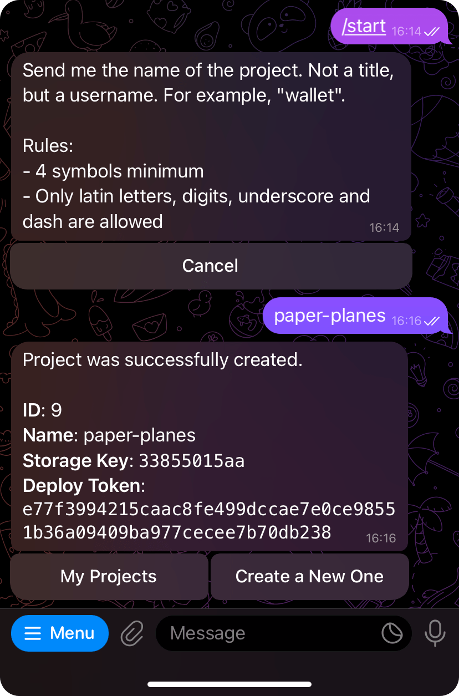

# Telegram Mini Apps Mate

Your companion for managing Telegram Mini Apps.

This project simplifies the manipulation of your mini app distribution files.

## Getting Started

To start using the project, you need to obtain your deploy token, which is unique to each project.
To get your token, go to [@tma_mate_bot](https://t.me/tma_mate_bot) and press the `Start` button.

<p align="center">
  
</p>

Next, press the `Create a Project` button and enter the name of your project, following the
specified rules.

<p align="center">
  
</p>

After this step, the bot will provide you with a `Deploy Token`, which you will use later to deploy
the project.

### Installing @telegram-apps/mate

To deploy your project, you need to install
the [@telegram-apps/mate](https://www.npmjs.com/package/@telegram-apps/mate) CLI package.

```bash
# Using pnpm
pnpm i -D @telegram-apps/mate
# or npm
npm i -D @telegram-apps/mate
# or yarn
yarn add -D @telegram-apps/mate
```

Once installed, the package will be accessible via the `mate` CLI tool:

```bash
mate --help
```

## Getting Project Info

Before deploying the project, you might want to know the base URL. The base URL is the absolute URL
that the project bundler will use to create links to all project assets.

To retrieve the project base URL, use the following command:

```bash
# TOKEN refers to the deploy token received from the bot.
mate deploy info --token {SPECIFY TOKEN HERE} --project paper-planes
```

You will see an output similar to this:

```
✔ Fetched deploy information for paper-planes
Base Path (using tag "latest"): https://cdn.webappsbot.com/tma-assets/1da9a53596/latest
This path will be used as a base path for the uploaded assets associated with this project.
Consider using this value as a base path in your bundler.
You can also use different tags using the --tag option.
```

The value `https://cdn.webappsbot.com/tma-assets/1da9a53596/latest` is the base URL that you should
use in your bundler.

## Deploying

Before deploying the project assets, ensure that you have built your project and are not deploying
source files. You should only deploy files that can be successfully opened by the user's browser.

Let’s assume you have a project named `paper-planes`, and it contains a `dist` directory with all
the built files. To deploy this directory to the CDN, use the following command:

```bash
# TOKEN refers to the deploy token received from the bot.
mate deploy upload --dir dist --token {SPECIFY TOKEN HERE} --project paper-planes
```

As a result, you will see a message like this in your console:

```
i Uploading directory: D:\users\qbnk\paper-planes\dist (2 files)
i Project: paper-planes
i Tag: latest
📁 dist
├ 📄 index.html (https://cdn.webappsbot.com/tma-assets/1da9a53596/latest/index.html)
├ 📄 create.png (https://cdn.webappsbot.com/tma-assets/1da9a53596/latest/create.png)
╰ 📄 start.png (https://cdn.webappsbot.com/tma-assets/1da9a53596/latest/start.png)
```

## Tagging

Mate allows you to use multiple tags in your project. A tag is simply a marker for your deployment
version.

Each tag corresponds to its own subdirectory, which is reflected in the final asset URL.

By default, Mate uses the `latest` tag. To override this, use the `--tag` option:

```bash
mate deploy upload --dir dist --token {SPECIFY TOKEN HERE} --project paper-planes --tag test
```

Here is the output:

```
✔ Fetched deploy information for paper-planes
Base Path (using tag "test"): https://cdn.webappsbot.com/tma-assets/1da9a53596/test
This path will be used as a base path for the uploaded assets associated with this project.
Consider using this value as a base path in your bundler.
You can also use different tags using the --tag option.
```

## Using Config

To enhance your experience, you can create a `mate.yml` file in your project root directory and
include the following content:

```yml
deploy:
  project: paper-planes
  directory: dist
  token: { SPECIFY TOKEN HERE }
```

Then, you can use the `mate` commands:

```bash
mate deploy info
mate deploy upload
```
